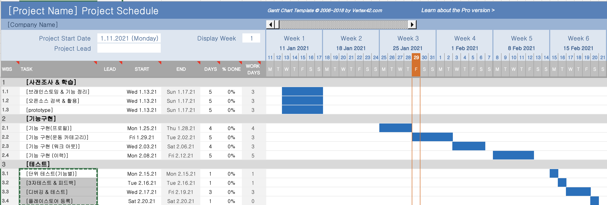

## 개요
 > ### 1. 문제 상황 인식 
 > ### 2. 프로젝트 주제 선정
 > ### 3. 간트차트 작성 및 사용할 tool 선정
 > ### 4. 브레인스토밍 및 구현할 기능 정리
 > ### 5. 유사 서비스 벤치마킹
 > ### 6. flutter 스터디
 > ### 7. 기능 구현(프로필, 운동 카테고리, 워크 아웃, 이력)
 > ### 8. 기능별 단위 테스트(기능별)
 > ### 9. 3자테스트 & 피드백
 > ### 10. 디버깅 & 테스트
 > ### 11.플레이스토어 등록

## 3. Gant Chart

